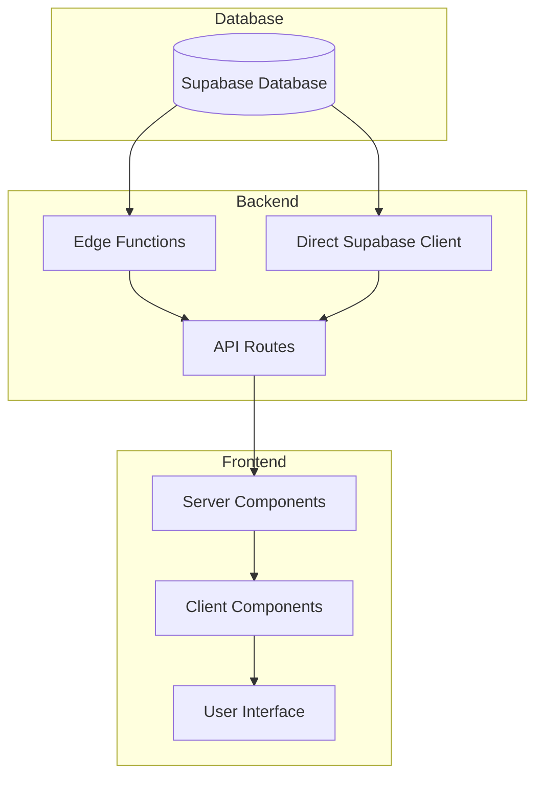
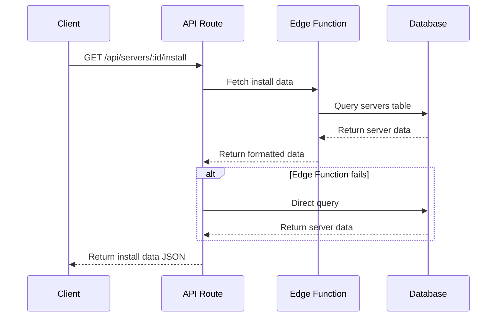
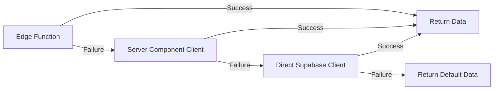
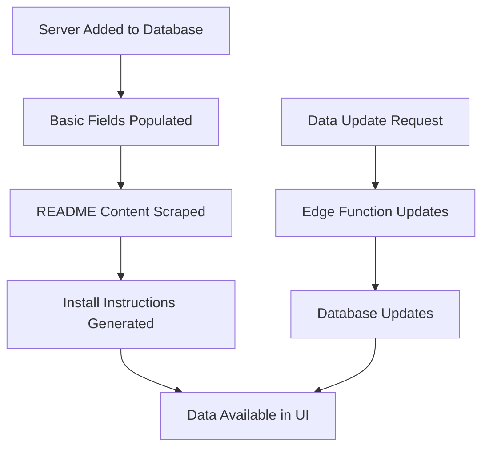

# Server Data Flow Documentation

This document describes the data flow for server detail pages, focusing on how data moves from the database to the UI, with special attention to README content and installation instructions.

## Data Flow Overview



## Detailed Data Flow

### 1. Database Structure

The `servers` table in the Supabase database contains the following relevant fields:

| Field | Type | Description |
|-------|------|-------------|
| id | string | Unique identifier for the server |
| name | string | Name of the server |
| description | string | Plain text description of the server |
| readme_overview | string | Rich HTML content for the Overview tab |
| readme_last_updated | timestamp | When the README was last updated |
| install_instructions | jsonb | Installation instructions by platform |
| install_code_blocks | jsonb | Code blocks for installation by platform |

### 2. Edge Functions

The `servers-install` edge function is responsible for retrieving installation data:

- **Input**: Server ID
- **Process**: Queries the `servers` table for the specific server
- **Output**: Installation instructions and code blocks JSON



### 3. API Routes

The installation API route (`/api/servers/[id]/install/route.ts`) employs a fallback strategy:

1. **Primary Path**: Call Supabase edge function with service role key
2. **Fallback Path 1**: Query database using `createServerComponentClient`
3. **Fallback Path 2**: Query database using direct Supabase client
4. **Response Format**: Consistent JSON structure regardless of data source

```typescript
// Response format
{
  instructions: Record<string, any>; // Platform-specific instructions
  code_blocks: Record<string, any>;  // Platform-specific code blocks
  platforms: string[];               // Available platforms
  defaultPlatform: string;           // Default platform to display
}
```

### 4. Server Components

The page component (`/app/servers/[id]/page.tsx`) fetches the server data:

1. Fetches server details using Supabase client
2. Passes data to the client component
3. Handles loading and error states

### 5. Client Components

The `ServerDetailClient` component:

1. Receives server data from the server component
2. Renders tabs including Overview, Installation, Compatibility, and Changelog
3. Passes specific data to specialized components like `OverviewTab`
4. Handles user interactions and tab switching

### 6. UI Rendering

The `OverviewTab` component:

1. Receives `description` and `readme_overview` props
2. Renders HTML content from `readme_overview` if available
3. Falls back to plain text `description` if necessary
4. Applies styling using Tailwind's prose classes

## Fallback Mechanisms



### Overview Tab Fallbacks

1. If `readme_overview` is available:
   - Render as HTML using `dangerouslySetInnerHTML`
   - Apply prose styling

2. If `readme_overview` is not available:
   - Render plain text `description`

### Installation Tab Fallbacks

1. If both `install_instructions` and `install_code_blocks` are available:
   - Render platform tabs and installation steps
   - Show code blocks with syntax highlighting

2. If data is partially or completely missing:
   - Provide empty objects for missing data
   - Render basic installation information
   - Show default platforms

## Data Update Lifecycle



This lifecycle ensures that server data is consistently available through the UI, with appropriate fallbacks at every step of the process.
